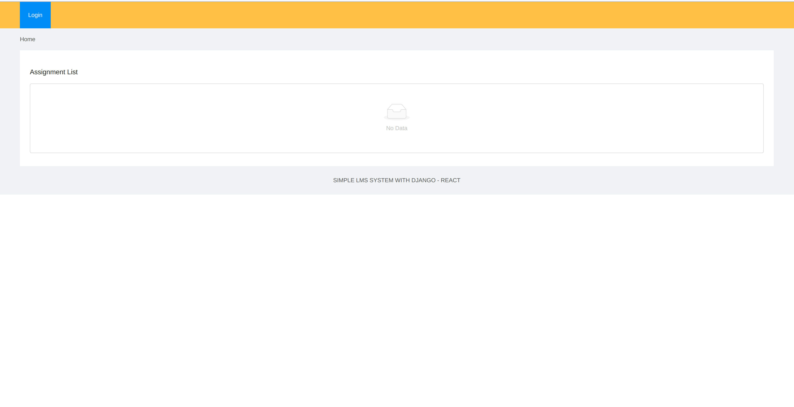

# Sipmle Learning Management System With React Django


This project contains a Django Rest API with a React frontend. Users are able to signup and login to their account. Teeachers are able to create quizes. Students are able to answer those quizes and view their results.

## Backend development workflow

```json
virtualenv -p [python version] env
source env/bin/activate
pip install -r requirements.txt
python manage.py migrate --run-syndcb
python manage.py runserver
```

## Frontend development workflow

```json
npm i
npm start
```

## For deploying

```json
npm run build
```

## Requirements
- > Django ~ 2.2 > 
- > Python ~ 3.6  > 
- > node ~ 16.x.x > 
- > npm  ~ 6.x.x > 

###

